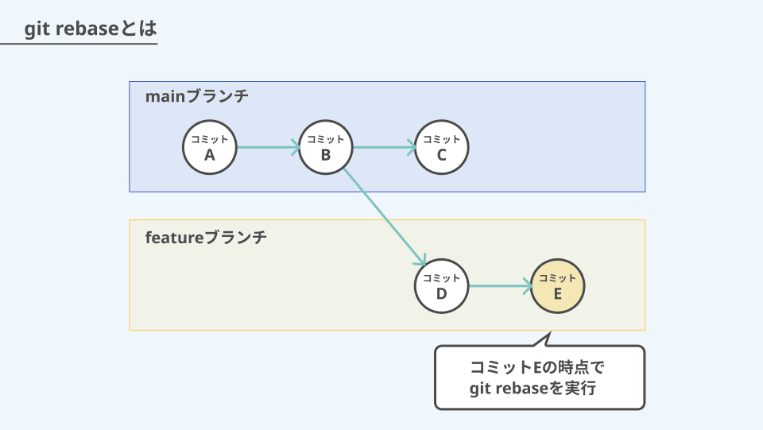
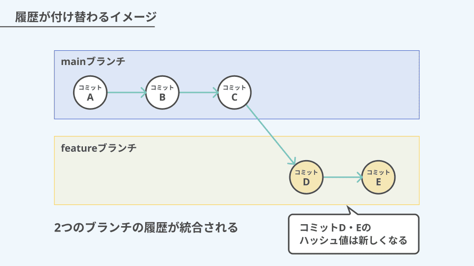

# rebase

**ブランチの履歴を付け替え（付け直し）するためのコマンド**

ブランチの履歴を付け替えて直線的に並べ直すことで、履歴をきれいに整理できる

１/2



2/2



## **rebase の主な使用用途**

**`git rebase`**  は、主に次のような場面で活躍する。

- PR（Pull Request）を出す前に余計なコミットや雑な履歴を整理したい
- コミットコメントの修正や、コミットの削除を行いたい
- コミット順を並べ替えたい

## 使用コマンド

**① 他人の最新変更を取り込む（履歴を綺麗に保つ）**

自分の feature が古いとき → 自分の変更が main の後ろにきれいに並ぶ

```powershell
git checkout feature
git fetch origin
git rebase origin/main
```

**② PR 前に履歴を整理したい ※実演する**

直近の 5 コミットを編集するケース

```powershell
git rebase -i HEAD~5
```

※ i は Interactive rebase の略称で、コミットを別ブランチの先頭に乗せるときに、**どのように乗せるか**を指定できるモード

エディタが開き、こう表示される

```powershell
pick abc123   add user model
pick dce456   fix typo
pick ef7890   debug
```

**ここで操作できる選択肢一覧**

| コマンド | 内容                     |
| -------- | ------------------------ |
| `pick`   | そのまま使う             |
| `reword` | メッセージを書き換える   |
| `edit`   | コミットの内容を修正する |
| `squash` | 前のコミットにまとめる   |
| `drop`   | コミットを削除する       |

③ rebase 中にやっぱやめたい

```powershell
git rebase --abort
```

編集が完了して反映させたい場合

```powershell
git push --force-with-lease
```

※ force-with-lease とは PUSH の際、ローカル ref とリモート ref を比較しローカルが最新か判定し、最新でなければ PUSH が失敗するというもの。

**git push --force は基本つかわないこと!!!!!!**

### 使用して OK,NG パターン

---

### ✅ OK なパターン

| 状況                                      | rebase して OK？ | 理由                 |
| ----------------------------------------- | ---------------- | -------------------- |
| ✅ 自分だけが触っているブランチ           | OK               | ほかの人に影響がない |
| ✅ 他の誰もそのブランチを pull していない | OK               | 履歴が食い違わない   |
| ✅ push 後すぐ、まだ誰も触っていない      | OK               | 安全                 |

### ❌ ダメなパターン

| 状況                                         | ダメな理由                                                |
| -------------------------------------------- | --------------------------------------------------------- |
| チームメンバーがその履歴を使って作業している | 他人の履歴と衝突 → pull 不能、push 不能、最悪コード消える |
| すでに PR が動いていて、レビュー中           | 履歴が消えるのでレビュアーが混乱                          |

- 個人の feature ブランチ内だけで使うこと
- 共有ブランチでは原則使用しないこと（履歴が壊れる）
