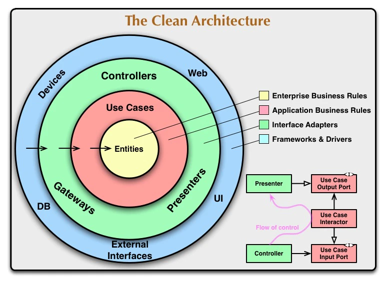

# Clean Architecture

## 目次

1. [clean-architecture-とは](#1-clean-architecture-とは)
1. [なぜ必要なのか](#2-なぜ必要なのか)
1. [クリーンアーキテクチャが生まれた背景](#3クリーンアーキテクチャが生まれた背景)
1. [普通の設計が崩壊する理由](#4-普通の設計が崩壊する理由)
1. [クリーンアーキテクチャの核心](#5-クリーンアーキテクチャの核心)
1. [クリーンアーキテクチャのメリット](#6クリーンアーキテクチャのメリット)
1. [クリーンアーキテクチャのデメリット](#7クリーンアーキテクチャのデメリット)
1. [レイヤー構成](#8-レイヤー構成)
1. [レイヤードアーキテクチャの役割](#9レイヤードアーキテクチャの役割)
1. [Spring Boot でのディレクトリ構成](#10-spring-boot-でのディレクトリ構成)
1. [レイヤー判定チートシート](#11-レイヤー判定チートシート)
1. [サンプルコード](#12-サンプルコード)
1. [MVC との違い](#13-mvc-との違い)
1. [フロント（React）でクリーンアーキテクチャの設計思想は必要なのか](#14-フロントreactでクリーンアーキテクチャの設計思想は必要なのか)

## 1. Clean Architecture とは

クリーンアーキテクチャは Robert C. Martin(Uncle Bob)が 2012 年に提唱した、設計思想で一言で表すと、

> 「業務ルールを技術から守る設計」

である

例えば将来的に

- MySQL → PostgreSQL
- REST API → GraphQL
- Spring MVC → Spring WebFlux
- React → Vue

へ変更したとしても、「発送済み注文はキャンセルできない」のような業務ルールは変わらない

そのため、

> 技術の変更が業務ロジックへ影響しない構造

にすることを目的にする

## 2. なぜ必要なのか

例 : 普通の Web API 処理

```ts
app.post("/login", async (req, res) => {
  // ユーザーを1件だけ取得 (prisma)
  const user = await prisma.user.findUnique({
    // 検索条件
    where: {
      email: req.body.email
    }
  })

  if (!user) {
    return res.status(404).json({
      error: "not found"
    })
  }

　// 入力されたパスワードが正しいか確認
  const ok = await bcrypt.compare(
    req.body.password,
    user.password
  )

  if (!ok) {
    return res.status(401).json({
      error: "invalid"
    })
  }

　// JWTトークン作成
  const token = jwt.sign(...)

  // 作成したトークンをJSONでクライアントに返却
  res.json({ token })
})
```

実装段階ではシンプルに見えるが、実務では後から

- iPhone アプリ対応
- GraphQL 対応
- DB 変更
- 認証方式変更
- 管理者権限追加
- 監査ログ追加

などが発生する

すると一箇所に処理が集中し、保守が困難になる

## 3.クリーンアーキテクチャが生まれた背景

歴史的には以下の流れ

### MVC

```
Model
View
Controller
```

---

### レイヤードアーキテクチャ

```
Controller
 ↓
Service
 ↓
Repository
 ↓
DB
```

業務系でよくあるやつ

問題と課題 : Service が肥大化する

そこで Clean Architecture の思想が生まれた

## 4. 普通の設計が崩壊する理由

例えばログイン処理に

- HTTP
- DB
- JWT
- 業務ルール

が混在すると、DB 変更だけのはずが

- 認証
- 権限
- API

まで影響することがある

つまり、<u>技術変更が業務ロジックを巻き込む状態に繋がる</u>

## 5. クリーンアーキテクチャの核心

クリーンアーキテクチャでは

> 業務ルールを中心に置く

という考えを取ります。

例えば「ログイン」の本質は

```
Express
Prisma
JWT
```

ではなく

> ユーザー認証

なので

> 認証ルールを技術から分離する

必要がある

## 6.クリーンアーキテクチャのメリット

### 1. 保守性が高い

- 各層が独立しているため、ある層に変更を加えても他の層に影響を与えにくい
- ビジネスロジックは外部の技術に依存しないため、UI やデータベースを変更しても影響を最小限に抑えられる

### 2. 再利用性が高くなる

- コアとなるビジネスロジック（エンティティやユースケース）は他のプロジェクトでも使い回し可能になる

### 3. テストが容易

- 各層が独立しているため、モックを利用してビジネスロジックやユースケースを単体テストしやすい

### 4. 拡張性が高い

- 外部システムや技術を差し替える場合でも、コア部分を変更せずに対応可能

## 7.クリーンアーキテクチャのデメリット

### 1. 初期コストが高い

- 複数の層に分けて設計するため、学習コストや開発の初期段階での工数が増える
- 小規模なプロジェクトでは過剰設計になることもある

### 2. 設計を守る運用コスト

- チーム全体でアーキテクチャの意図を理解し、一貫性を保つためのコミュニケーションが必要になる
- 層の境界を曖昧にすると、意図しない依存が生まれるリスクがある

## 8. レイヤー構成

ざっくりのイメージ

```
Controller
↓
UseCase
↓
Entity
↓
Repository
↓
Infrastructure
↓
DB / API
```

## 9.レイヤードアーキテクチャの役割



---

### Entity

> 「業務ルール」

を表現する層

例

```
・在庫 0 なら購入不可
・自分自身はフォロー不可
・残高不足なら送金不可
```

---

### UseCase

> 「ユーザーが何をしたいか」

を表現する層

例

```
・商品を購入したい
・注文をキャンセルしたい
・クーポンを使いたい
```

**UseCase = 操作手順**

---

### Controller

> HTTP リクエストの受け取り

を表現する層

---

### まとめ

Entity→ 業務仕様・業務ルールを書く

UseCase → ユーザーや外部システムからの要求に対して、アプリケーションが行う処理の流れを書く

Controller → HTTP リクエストを受け取り、
入力値を UseCase に渡し、結果をレスポンスに変換する

Infrastructure → DB、外部 API、メール送信、ファイル保存などの技術詳細を書く

Repository → Entity を保存・取得するための窓口

## 10. Spring Boot でのディレクトリ構成

あくまでサンプル

```
src/main/java/com/example/app
├── presentation
│   ├── controller
│   │   └── OrderController.java
│   └── dto
│       ├── request
│       │   └── CancelOrderRequest.java
│       └── response
│           └── OrderResponse.java
│
├── application
│   ├── usecase
│   │   ├── CancelOrderUseCase.java
│   │   └── CreateOrderUseCase.java
│   ├── command
│   │   └── CancelOrderCommand.java
│   └── service
│       └── OrderApplicationService.java
│
├── domain
│   ├── model
│   │   └── Order.java
│   ├── valueobject
│   │   ├── OrderId.java
│   │   └── Money.java
│   ├── repository
│   │   └── OrderRepository.java
│   └── exception
│       └── OrderCannotCancelException.java
│
├── infrastructure
│   ├── persistence
│   │   ├── entity
│   │   │   └── OrderJpaEntity.java
│   │   ├── mapper
│   │   │   └── OrderPersistenceMapper.java
│   │   ├── springdata
│   │   │   └── SpringDataOrderRepository.java
│   │   └── OrderRepositoryImpl.java
│   └── external
│       └── PaymentApiClient.java
│
└── config
    └── BeanConfig.java
```

- domain = 業務の中心
- infrastructure = 技術の詳細
- presentation = 入出力
- application = 業務を進める手順

## 11. レイヤー判定チートシート

| レイヤー     | 判定基準       |
| ------------ | -------------- |
| 業務ルール？ | Entity         |
| 処理の流れ？ | UseCase        |
| HTTP？       | Controller     |
| 保存・取得？ | Repository     |
| DB や ORM？  | Infrastructure |

## 12. サンプルコード

注文キャンセル

■ Controller

```java
@RestController
@RequestMapping("/orders")
public class OrderController {

    private final CancelOrderUseCase cancelOrderUseCase;

    public OrderController(CancelOrderUseCase cancelOrderUseCase) {
        this.cancelOrderUseCase = cancelOrderUseCase;
    }

    @PostMapping("/{orderId}/cancel")
    public ResponseEntity<Void> cancel(@PathVariable Long orderId) {
        cancelOrderUseCase.execute(new CancelOrderCommand(orderId));
        return ResponseEntity.noContent().build();
    }
}
```

■ UseCase

```java
@Service
public class CancelOrderUseCase {

    private final OrderRepository orderRepository;

    public CancelOrderUseCase(OrderRepository orderRepository) {
        this.orderRepository = orderRepository;
    }

    public void execute(CancelOrderCommand command) {
        Order order = orderRepository.findById(command.orderId());

        order.cancel();

        orderRepository.save(order);
    }
}
```

■ Domain Model / Entity

```java
public class Order {

    private Long id;
    private OrderStatus status;

    public void cancel() {
        if (status == OrderStatus.SHIPPED) {
            throw new OrderCannotCancelException("発送済みの注文はキャンセルできません");
        }

        this.status = OrderStatus.CANCELED;
    }
}
```

■ Repository interface

```java
public interface OrderRepository {
    Order findById(Long id);
    void save(Order order);
}
```

■ Infrastructure

```java
@Repository
public class OrderRepositoryImpl implements OrderRepository {

    private final SpringDataOrderRepository repository;
    private final OrderPersistenceMapper mapper;

    public OrderRepositoryImpl(
        SpringDataOrderRepository repository,
        OrderPersistenceMapper mapper
    ) {
        this.repository = repository;
        this.mapper = mapper;
    }

    @Override
    public Order findById(Long id) {
        OrderJpaEntity entity = repository.findById(id)
            .orElseThrow();

        return mapper.toDomain(entity);
    }

    @Override
    public void save(Order order) {
        repository.save(mapper.toJpaEntity(order));
    }
}
```

■ Spring Data JPA

```java
public interface SpringDataOrderRepository
    extends JpaRepository<OrderJpaEntity, Long> {
}
```

## 13. MVC との違い

```
Controller
↓
Service
↓
Repository
```

MVC は Service が何でも屋になる

## 14. フロント（React）でクリーンアーキテクチャの設計思想は必要なのか

> 必須ではない

あくまで役割は

- 画面表示
- ユーザー入力
- API 呼び出し
- 状態管理

など画面都合のロジックになるため

フロントでドメインロジック、業務ルールを組み込むならありだが、大体その責務はバックエンドに持っていくことが多い

---

### ロジックのイメージ

「業務の本質」なのか「画面都合」で違いがある

| フロントエンド     | バックエンド     |
| ------------------ | ---------------- |
| 入力チェック       | 購入可能か       |
| 表示制御           | 契約可能か       |
| ページネーション   | キャンセル可能か |
| ソート             | 割引適用可能か   |
| 検索条件           | 権限があるか     |
| URL パラメータ     | 認証の可否       |
| ローディング管理   | データの更新     |
| エラーハンドリング | 排他制御         |

---

### 個人的見解

React の責務に合わせて基づいたディレクトリ構成で足りる

```
features/order/
├── components
│   └── CancelOrderButton.tsx
├── hooks
│   └── useCancelOrder.ts
├── api
│   └── orderApi.ts
└── types
    └── order.ts
```
